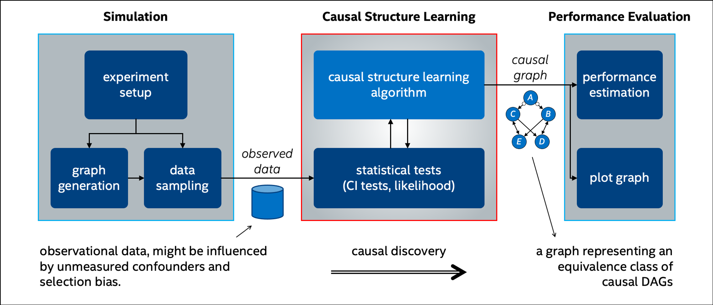
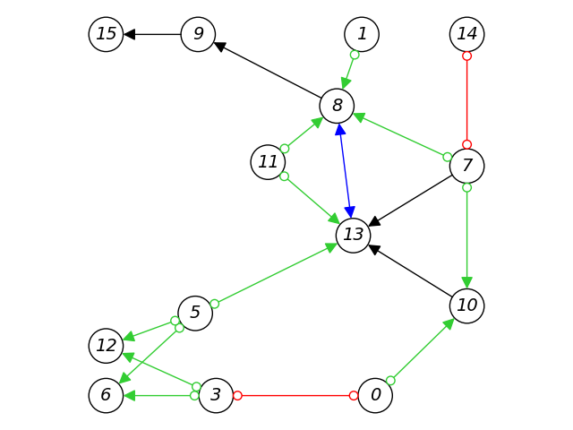

# Causality Lab

This repository contains research code of novel causal discovery algorithms developed at Intel Labs, as well as other common algorithms, 
and classes for developing and examining new algorithms for causal structure learning.

**Update (December 2023)**: [CLEANN](https://arxiv.org/abs/2310.20307 "Rohekar Raanan, Gurwicz Yaniv, and Nisimov Shami. NeurIPS 2023") is novel algorithm presented at [NeurIPS 2023](https://neurips.cc/ "Advances in Neural Information Processing Systems"). It generates causal explanations for the outcomes of existing pre-trained Transformer neural networks. At its core, it is based on the novel causal interpretation of self-attention presented in the paper, and executes attention-based causal-discovery (ABCD).
[This notebook](notebooks/causal_reasoning_with_CLEANN_explanations.ipynb) demonstrates, using a simple example, how to use CLEANN.

## Table of Contents

- [Algorithms and Baselines](#algorithms-and-baselines)
- [Developing and Examining Algorithms](#developing-and-examining-algorithms)
- [Installation](#installation)
- [Usage Example](#usage-example)
- [References](#references)


## Algorithms and Baselines

Included algorithms learn causal structures from observational data, and reason using these learned causal graphs.
There are three families of algorithms:

1. **Causal discovery under causal sufficiency and bayesian network structure learning**
   1. PC algorithm (Spirtes et al., 2000)
   2. RAI algorithm, Recursive Autonomy Identification ([Yehezkel and Lerner, 2009](https://www.jmlr.org/papers/volume10/yehezkel09a/yehezkel09a.pdf)). This algorithm is used for learning the structure in the B2N algorithm ([Rohekar et al., NeurIPS 2018b](https://arxiv.org/pdf/1806.09141.pdf)) 
   3. B-RAI algorithm, Bootstrap/Bayesian-RAI for uncertainty estimation ([Rohekar et al., NeurIPS 2018a](https://arxiv.org/abs/1809.04828)). This algorithm is used for learning the structure of BRAINet ([Rohekar et al., NeurIPS 2019](https://arxiv.org/abs/1905.13195))

2. **Causal discovery in the presence of latent confounders and selection bias**
   1. FCI algorithm, Fast Causal Inference (Spirtes et at., 2000)
   2. ICD algorithm, Iterative Causal Discovery ([Rohekar et al., NeurIPS 2021](https://arxiv.org/abs/2111.04095))
   3. TS-ICD algorithm, ICD for time-series data ([Rohekar et al., ICML 2023](https://arxiv.org/abs/2306.00624))
3. **Causal reasoning**
   1. CLEANN algorithm, Causal Explanation from Attention in Neural Networks ([Rohekar et al., 2023](https://arxiv.org/abs/2310.20307 "Rohekar Raanan, Gurwicz Yaniv, and Nisimov Shami. NeurIPS 2023"), [Nisimov et al., 2022](https://arxiv.org/abs/2210.10621 "Nisimov Shami, Rohekar Raanan, Gurwicz Yaniv, Koren Guy, and Novik Gal. CONSEQUENCES, RecSys 2022")).


## Developing and Examining Algorithms

This repository includes several classes and methods for implementing new algorithms and testing them. These can be grouped into three categories:

1. **Simulation**:
   1. [Random DAG sampling](experiment_utils/synthetic_graphs.py)
   2. [Observational data sampling](experiment_utils/synthetic_graphs.py)
2. **Causal structure learning**:
   1. [Classes for handling graphical models](graphical_models) (e.g., methods for graph traversal and calculating graph properties). Supported graph types:
      1. Directed acyclic graph (DAG): commonly used for representing causal DAGs
      2. Partially directed graph (PDAG/CPDAG): a Markov equivalence class of DAGs under causal sufficiency
      3. Undirected graph (UG) usually used for representing adjacency in the graph (skeleton)
      4. Ancestral graph (PAG/MAG): a MAG is an equivalence class of DAGs, and a PAG is an equivalence class of MAGs (Richardson and Spirtes, 2002).
   3. [Statistical tests (CI tests)](causal_discovery_utils/cond_indep_tests.py) operating on data and a perfect CI oracle (see [causal discovery with a perfect oracle](notebooks/causal_discovery_with_a_perfect_oracle.ipynb)) 
3. **Performance evaluations**:
   1. [Graph structural accuracy](causal_discovery_utils/performance_measures.py) 
      1. Skeleton accuracy: FNR, FPR, structural Hamming distance 
      2. Orientation accuracy 
      3. Overall graph accuracy: BDeu score 
   2. [Computational cost](causal_discovery_utils/cond_indep_tests.py): Counters for CI tests (internal caching ensures counting once each a unique test)
   3. [Plots for DAGs and ancestral graphs](plot_utils).

A new algorithm can be developed by inheriting classes of existing algorithms (e.g., B-RAI inherits RAI) or by creating a new class.
The only method required to be implemented is `learn_structure()`. For conditional independence testing, 
we implemented conditional mutual information, partial correlation statistical test, and d-separation (perfect oracle). 
Additionally, a Bayesian score (BDeu) can be used for evaluating the posterior probability of DAGs given data.




## Installation

This code has been tested on Ubuntu 18.04 LTS and macOS Catalina, with Python 3.5. 
We recommend installing and running it in a virtualenv.

```
sudo -E pip3 install virtualenv
virtualenv -p python3 causal_env
. causal_env/bin/activate

git clone https://github.com/IntelLabs/causality-lab.git
cd causality-lab
pip install -r requirements.txt
```

## Usage Example

### Learning a Casual Structure from Observed Data

All causal structure learning algorithms are classes with a `learn_structure()` method that learns the causal graph. 
The learned causal graph is a public class member, simply called `graph`, which is an instance of a graph class. 
The structure learning algorithms does not have direct access to the data, instead they call a statistical test which accesses the data.

Let's look at the following example: causal structure learning with ICD using a given dataset.

```angular2html
par_corr_test = CondIndepParCorr(dataset, threshold=0.01)  # CI test with the given significance level
icd = LearnStructICD(nodes_set, par_corr_test)  # instantiate an ICD learner
icd.learn_structure()  # learn the causal graph
```

For complete examples, see [causal discovery with latent confounders](notebooks/causal_discovery_with_latent_confounders.ipynb) and [causal discovery under causal sufficiency](notebooks/causal_discovery_under_causal_sufficiency.ipynb) notebooks.
The learned structures can then be plotted - see a complete example for creating a PAG, calculating its properties, and plotting it in the [partial ancestral graphs](notebooks/partial_ancestral_graphs.ipynb) notebook.




## References

* Rohekar, Raanan, Yaniv Gurwicz, and Shami Nisimov. "Causal Interpretation of Self-Attention in Pre-Trained Transformers". Advances in Neural Information Processing Systems (NeurIPS) 36, 2023. 
* Rohekar, Raanan Y., Shami Nisimov, Yaniv Gurwicz, and Gal Novik. "From Temporal to Contemporaneous Iterative Causal Discovery in the Presence of Latent Confounders" International Conference on Machine Learning (ICML), 2023.
* Nisimov, Shami, Raanan Y. Rohekar, Yaniv Gurwicz, Guy Koren, and Gal Novik. "CLEAR: Causal Explanations from Attention in Neural Recommenders". Causality, Counterfactuals and Sequential Decision-Making for Recommender Systems (CONSEQUENCES) workshop at RecSys, 2022.
* Rohekar, Raanan Y., Shami Nisimov, Yaniv Gurwicz, and Gal Novik. "Iterative Causal Discovery in the Possible Presence of Latent Confounders and Selection Bias" Advances in Neural Information Processing Systems (NeurIPS) 34, 2021. 
* Rohekar, Raanan Y., Yaniv Gurwicz, Shami Nisimov, and Gal Novik. "Modeling Uncertainty by Learning a Hierarchy of Deep Neural Connections". Advances in Neural Information Processing Systems (NeurIPS) 32: 4244-4254, 2019.
* Rohekar, Raanan Y., Yaniv Gurwicz, Shami Nisimov, Guy Koren, and Gal Novik. "Bayesian Structure Learning by Recursive Bootstrap." Advances in Neural Information Processing Systems (NeurIPS) 31: 10525-10535, 2018a.
* Rohekar, Raanan Y., Shami Nisimov, Yaniv Gurwicz, Guy Koren, and Gal Novik. "Constructing Deep Neural Networks by Bayesian Network Structure Learning". Advances in Neural Information Processing Systems (NeurIPS) 31: 3047-3058, 2018b.
* Yehezkel, Raanan, and Boaz Lerner. "Bayesian Network Structure Learning by Recursive Autonomy Identification". Journal of Machine Learning Research (JMLR) 10, no. 7, 2009
* Richardson, Thomas, and Peter Spirtes. "Ancestral graph Markov models". The Annals of Statistics, 30 (4): 962–1030, 2002.
* Spirtes Peter, Clark N. Glymour, Richard Scheines, and David Heckerman. "Causation, prediction, and search". MIT press, 2000.
