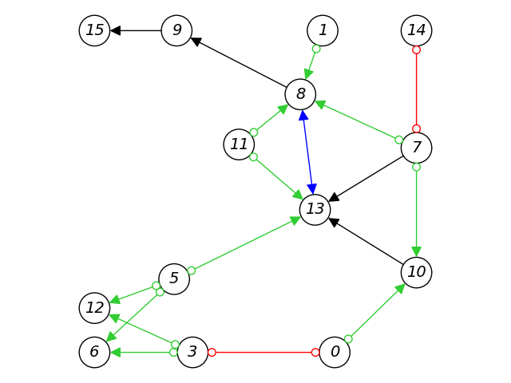
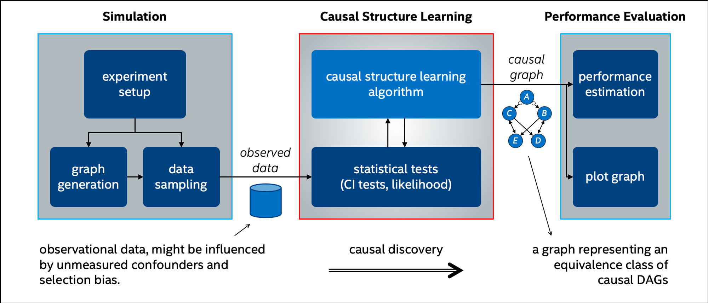

# Causality Lab

> Causal discovery & reasoning algorithms from Intel Labs — research code, baselines, and tooling for causal structure learning.


This repository contains research code for novel causal-discovery algorithms developed at Intel Labs, along with implementations of classes and functions for developing and evaluating new algorithms for causal structure learning.

> [!NOTE]
> **July 2025 — A Causal World Model Underlying Next Token Prediction**
>
> Can a GPT model, trained simply to predict the next token in a sequence, actually learn the underlying mechanisms of a domain? This question is addressed in a [paper](https://arxiv.org/abs/2412.07446 "Raanan Y. Rohekar, Yaniv Gurwicz, Sungduk Yu, Estelle Aflalo, and Vasudev Lal. ICML 2025"), presented at [ICML 2025](https://icml.cc "International Conference on Machine Learning"), where causal structures are learned from the attention mechanism of pre-trained GPT models.
>
> The causal discovery algorithm, called **Ordered ICD (OrdICD)**, uses the given causal order to reduce the total number of CI tests compared to the ICD algorithm. See a [notebook](notebooks/causal_discovery_with_known_causal_order_latent_confounders.ipynb) for a simple synthetic example demonstrating OrdICD.

> [!NOTE]
> **CLEANN — Causal Explanations from Attention**
>
> [CLEANN](https://arxiv.org/abs/2310.20307 "Rohekar Raanan, Gurwicz Yaniv, and Nisimov Shami. NeurIPS 2023") is a novel algorithm presented at [NeurIPS 2023](https://neurips.cc "Advances in Neural Information Processing Systems") that generates causal explanations for the outcomes of existing pre-trained BERT neural networks. At its core, it is based on a novel causal interpretation of self-attention and executes attention-based causal-discovery (ABCD).
>
> [This notebook](notebooks/causal_reasoning_with_CLEANN_explanations.ipynb) demonstrates, using a simple example, how to use CLEANN.

## Table of Contents

- [Usage Example](#usage-example)
- [Algorithms and Baselines](#algorithms-and-baselines)
- [Developing and Examining Algorithms](#developing-and-examining-algorithms)
- [Installation](#installation)
- [References](#references)


## Usage Example

### Learning a Causal Structure from Observed Data

All causal structure learning algorithms are classes with a `learn_structure()` method that learns the causal graph.
The learned causal graph is a public class member, simply called `graph`, which is an instance of a graph class.
The structure learning algorithms do not have direct access to the data; instead they call a statistical test which accesses the data.

Let's look at the following example: causal structure learning with ICD using a given dataset.

```python
par_corr_test = CondIndepParCorr(dataset, threshold=0.01)  # CI test with the given significance level
icd = LearnStructICD(nodes_set, par_corr_test)  # instantiate an ICD learner
icd.learn_structure()  # learn the causal graph
```

After this, `icd.graph` holds the learned PAG; see the plotting notebook to visualize it.

For complete examples, see [causal discovery with latent confounders](notebooks/causal_discovery_with_latent_confounders.ipynb) and [causal discovery under causal sufficiency](notebooks/causal_discovery_under_causal_sufficiency.ipynb) notebooks.
The learned structures can then be plotted — see a complete example for creating a PAG, calculating its properties, and plotting it in the [partial ancestral graphs](notebooks/partial_ancestral_graphs.ipynb) notebook.




## Algorithms and Baselines

Included algorithms learn causal structures from observational data, and reason over learned causal graphs.
There are three families of algorithms:

### 1. Causal discovery under causal sufficiency and Bayesian network structure learning

- **PC** algorithm (Spirtes et al., 2000)
- **RAI** algorithm — Recursive Autonomy Identification ([Yehezkel and Lerner, 2009](https://www.jmlr.org/papers/volume10/yehezkel09a/yehezkel09a.pdf)). Used for learning the structure in the B2N algorithm ([Rohekar et al., NeurIPS 2018b](https://arxiv.org/pdf/1806.09141.pdf)).
- **B-RAI** algorithm — Bootstrap/Bayesian-RAI for uncertainty estimation ([Rohekar et al., NeurIPS 2018a](https://arxiv.org/abs/1809.04828)). Used for learning the structure of BRAINet ([Rohekar et al., NeurIPS 2019](https://arxiv.org/abs/1905.13195)).

### 2. Causal discovery in the presence of latent confounders and selection bias

- **FCI** algorithm — Fast Causal Inference (Spirtes et al., 2000)
- **ICD** algorithm — Iterative Causal Discovery ([Rohekar et al., NeurIPS 2021](https://arxiv.org/abs/2111.04095))
- **OrdICD** algorithm — ICD using a causal order ([Rohekar et al., ICML 2025](https://arxiv.org/abs/2412.07446))
- **TS-ICD** algorithm — ICD for time-series data ([Rohekar et al., ICML 2023](https://arxiv.org/abs/2306.00624))

### 3. Causal reasoning

- **CLEANN** algorithm — Causal Explanation from Attention in Neural Networks ([Rohekar et al., 2023](https://arxiv.org/abs/2310.20307 "Rohekar Raanan, Gurwicz Yaniv, and Nisimov Shami. NeurIPS 2023"); [Nisimov et al., 2022](https://arxiv.org/abs/2210.10621 "Nisimov Shami, Rohekar Raanan, Gurwicz Yaniv, Koren Guy, and Novik Gal. CONSEQUENCES, RecSys 2022")).
- **A Causal World Model Underlying Next Token Prediction** ([Rohekar et al., 2025](https://arxiv.org/abs/2412.07446 "Raanan Y. Rohekar, Yaniv Gurwicz, Sungduk Yu, Estelle Aflalo, and Vasudev Lal. ICML 2025")).


## Developing and Examining Algorithms

This repository includes several classes and methods for implementing new algorithms and testing them. These can be grouped into three categories:

1. **Simulation**:
   1. [Random DAG sampling](experiment_utils/synthetic_graphs.py)
   2. [Observational data sampling](experiment_utils/synthetic_graphs.py)
2. **Causal structure learning**:
   1. [Classes for handling graphical models](graphical_models) (e.g., methods for graph traversal and calculating graph properties). Supported graph types:
      1. Directed acyclic graph (DAG): commonly used for representing causal DAGs
      2. Partially directed graph (PDAG/CPDAG): a Markov equivalence class of DAGs under causal sufficiency
      3. Undirected graph (UG) usually used for representing adjacency in the graph (skeleton)
      4. Ancestral graph (PAG/MAG): a MAG is an equivalence class of DAGs, and a PAG is an equivalence class of MAGs (Richardson and Spirtes, 2002).
   2. [Statistical tests (CI tests)](causal_discovery_utils/cond_indep_tests.py) operating on data and a perfect CI oracle (see [causal discovery with a perfect oracle](notebooks/causal_discovery_with_a_perfect_oracle.ipynb))
3. **Performance evaluations**:
   1. [Graph structural accuracy](causal_discovery_utils/performance_measures.py)
      1. Skeleton accuracy: FNR, FPR, structural Hamming distance
      2. Orientation accuracy
      3. Overall graph accuracy: BDeu score
   2. [Computational cost](causal_discovery_utils/cond_indep_tests.py): Counters for CI tests (internal caching ensures counting once each a unique test)
   3. [Plots for DAGs and ancestral graphs](plot_utils).

A new algorithm can be developed by inheriting classes of existing algorithms (e.g., B-RAI inherits RAI) or by creating a new class.
The only method required to be implemented is `learn_structure()`. For conditional independence testing,
we implemented conditional mutual information, partial correlation statistical test, and d-separation (perfect oracle).
Additionally, a Bayesian score (BDeu) can be used for evaluating the posterior probability of DAGs given data.




## Installation

This code has been tested with Python 3.10+. We recommend installing and running it in a virtualenv.

```bash
sudo -E pip3 install virtualenv
virtualenv -p python3 causal_env
. causal_env/bin/activate

git clone https://github.com/IntelLabs/causality-lab.git
cd causality-lab
pip install -r requirements.txt
```


## References

- **ICML 2025** — Rohekar Raanan Y., Yaniv Gurwicz, Sungduk Yu, Estelle Aflalo, and Vasudev Lal. "A Causal World Model Underlying Next Token Prediction: Exploring GPT in a Controlled Environment".
- **NeurIPS 2023** — Rohekar, Raanan Y., Yaniv Gurwicz, and Shami Nisimov. "Causal Interpretation of Self-Attention in Pre-Trained Transformers". Vol. 36.
- **ICML 2023** — Rohekar, Raanan Y., Shami Nisimov, Yaniv Gurwicz, and Gal Novik. "From Temporal to Contemporaneous Iterative Causal Discovery in the Presence of Latent Confounders".
- **RecSys 2022** — Nisimov, Shami, Raanan Y. Rohekar, Yaniv Gurwicz, Guy Koren, and Gal Novik. "CLEAR: Causal Explanations from Attention in Neural Recommenders". CONSEQUENCES workshop.
- **NeurIPS 2021** — Rohekar, Raanan Y., Shami Nisimov, Yaniv Gurwicz, and Gal Novik. "Iterative Causal Discovery in the Possible Presence of Latent Confounders and Selection Bias". Vol. 34.
- **NeurIPS 2019** — Rohekar, Raanan Y., Yaniv Gurwicz, Shami Nisimov, and Gal Novik. "Modeling Uncertainty by Learning a Hierarchy of Deep Neural Connections". Vol. 32: 4244–4254.
- **NeurIPS 2018a** — Rohekar, Raanan Y., Yaniv Gurwicz, Shami Nisimov, Guy Koren, and Gal Novik. "Bayesian Structure Learning by Recursive Bootstrap." Vol. 31: 10525–10535.
- **NeurIPS 2018b** — Rohekar, Raanan Y., Shami Nisimov, Yaniv Gurwicz, Guy Koren, and Gal Novik. "Constructing Deep Neural Networks by Bayesian Network Structure Learning". Vol. 31: 3047–3058.
- **JMLR 2009** — Yehezkel, Raanan, and Boaz Lerner. "Bayesian Network Structure Learning by Recursive Autonomy Identification". Vol. 10, no. 7.
- **2002** — Richardson, Thomas, and Peter Spirtes. "Ancestral graph Markov models". *The Annals of Statistics*, 30 (4): 962–1030.
- **2000** — Spirtes, Peter, Clark N. Glymour, Richard Scheines, and David Heckerman. "Causation, Prediction, and Search". MIT Press.
